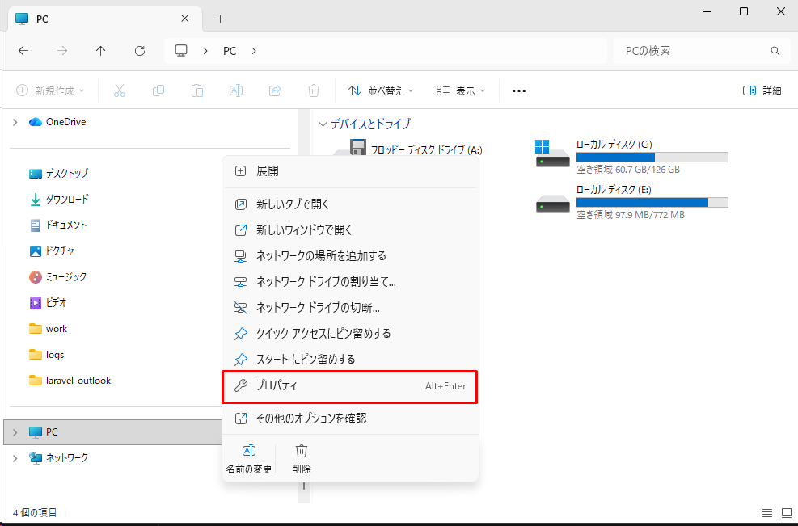
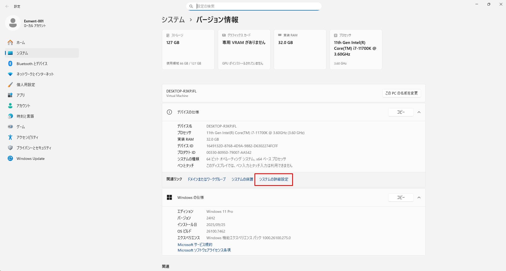
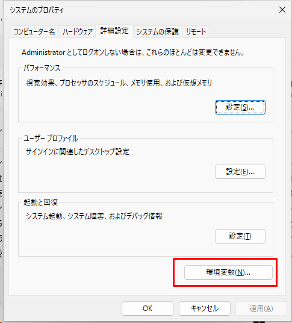
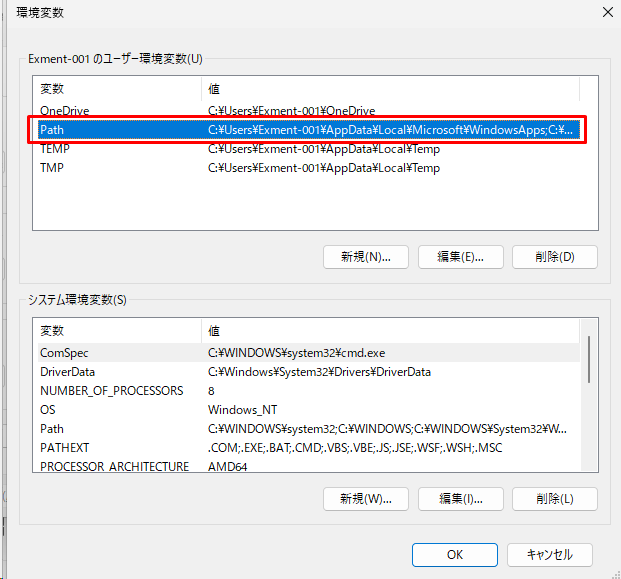
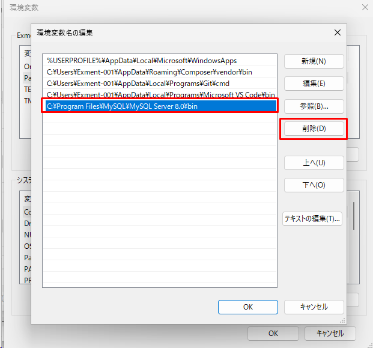

# MySQL installation procedure
These are the steps for using MySQL with Exment.   
※Various steps may differ depending on the OS, version, installation time, etc.   


## MySQL settings (Windows)

- **(Only if MySQL5.7 is present)**  
[Database backup](https://dev.mysql.com/doc/refman/8.0/en/mysqldump-sql-format.html).

- **(Only if MySQL5.7 is present)**  
Type Command Prompt into the search bar to the right of the Start button.   
Right-click Command Prompt, which appears at the top of the most matching search results.   
Right-click and select Run as administrator from the menu that appears.
   
Stop MySQL.   

~~~
net stop mysql57
~~~

- Access the site below and download MySQL.   
[MySQL Download](https://downloads.mysql.com/archives/installer/)  

- Select the latest version with Product Version 8.0.X.   


- In the row that does not include web in the file name, click Download on the row with the largest file size to download.   


- Run the downloaded file and proceed with the installation.   

- For Choosing a Setup type, select Custom.   
  

- Under Select Products and Features, click MySQL Servers > MySQL Server > MySQL Server 8.0 and you'll see MySQL Server X64 and X86.   
Click on one line according to the version of the OS you are using, and then click → in the middle.     
  

- (Optional) If you want to install MySQL Workbench, click Applications > MySQL Workbench > MySQL Workbench 8.0 and MySQL Workbench will be displayed.   
Click on this line and click → in the middle.     
※MySQL Workbench is an application that makes it easier to access MySQL data from a GUI.   
  


- Click Yes or Install until completed.   
  

- On the Installation page, click Execute to begin the installation.   
  

-Click Next.   
  

- For Type and Networking, use the default settings.   
  

- Enter the root user password.   
Be sure to remember this, as you will need it when using MySQL with Exment etc. in the future.   
  

- After that, follow the wizard and press Next several times to proceed with the installation.
  
  

- Installation is complete.   
  

- Fix my.ini. (C:\ProgramData\MySQL\MySQL Server 8.0\my.ini)

~~~
# Add the following to the end

local-infile=1
~~~

- Start a command prompt with administrator privileges and stop MySQL.   

~~~
net stop mysql80
~~~  

- Start MySQL.

~~~
net start mysql80
~~~

### New installation: MySQL 8.4 (Windows)

If MySQL is not installed on your machine yet, follow these steps to install MySQL 8.4.

- Download MySQL Community Server (Windows) from the following page.
	- Note: MySQL Installer is available only for the MySQL 8.0 series. For MySQL 8.1 and later (including 8.4), download MySQL Server as an MSI or ZIP package.
	- [MySQL Community Server Downloads](https://downloads.mysql.com/archives/community/)
	- In Select Version, choose 8.4.X, then choose Windows (x86, 64-bit).
	

- Download one of the following packages:
	- MSI Installer (recommended) - easy installation with a wizard.
	- ZIP Archive (advanced) - manual installation.
	

- Run the MSI file and follow the wizard.
	- On the Welcome screen, click Next to start.
	
	- Accept the License Agreement and click Next.
	
	- For setup type, select **Complete** to install all features.
	
	- Click Install to start installing.
	
	- Wait for installation to complete, then click Finish.
	
	- After the MSI installation finishes, the configuration tool (MySQL Configurator) starts automatically.
	- On **Welcome to the MySQL Server Configurator**, click **Next**.
    

	- **Data Directory:**
    - Keep the default path where MySQL stores data (typically `C:\ProgramData\MySQL\MySQL Server 8.4\`).
    - Click **Next**.
    

	- **Type and Networking:**
    - **Config Type**: Select `Development Computer`.
    - **Connectivity**: Check `TCP/IP`. The default port is `3306` (if another MySQL instance already uses it, change to 3307 or 3308).
    - Check **Open Windows Firewall ports for network access** if you need external connections.
    - Click **Next**.
    

	- **Accounts and Roles:**
    - Enter the `root` password in **MySQL Root Password** and **Repeat Password**.
    - Note: Remember this password; it is the highest-privilege administrator credential.
    - Click **Next**.
    

	- **Windows Service:**
    - **Windows Service Name**: Set a service name, for example `MySQL84`, to distinguish it.
    - Check **Start the MySQL Server at System Startup** to start MySQL automatically on boot.
    - Select **Standard System Account** (recommended).
    - Click **Next**.
    

	- **Server File Permissions:**
    - Select **Yes, grant full access...** to grant the MySQL service full access to the data directory.
    - Click **Next**.
    

	- **Sample Databases:**
    - You can skip this step (do not select anything) to keep MySQL clean.
    - Click **Next**.
    

	- **Apply Configuration:**
    - Click **Execute** to start configuration.
    
    - Wait until all steps show green checks, then click **Next** and **Finish**.

- Edit the configuration file `my.ini`.
	- Path: `C:\ProgramData\MySQL\MySQL Server 8.4\my.ini`
	- Add the following line to the end of the file:

~~~
local-infile=1
~~~

- Restart MySQL to apply the configuration.

~~~
net stop mysql84
net start mysql84
~~~

- Verify the version.

~~~
mysql --version
~~~

- (Optional) Verify inside MySQL:

~~~
mysql -u root -p -e "SELECT VERSION();"
~~~

### Upgrade to MySQL 8.4 (Windows)

- Recommendation: Back up your data before upgrading.
	- If you have important databases, create a dump/backup (for example with `mysqldump`) and make sure you know the existing `root` password.

- Download MySQL Community Server (Windows) from the following page.
	- Note: MySQL Installer is available only for the MySQL 8.0 series. For MySQL 8.1 and later (including 8.4), download MySQL Server as an MSI or ZIP package.
	- [MySQL Community Server Downloads](https://downloads.mysql.com/archives/community/)
	- In Select Version, choose 8.4.X, then choose Windows (x86, 64-bit).
	- Use the dropdown lists (Select Version / Select Operating System) to filter to the correct MySQL 8.4 build for Windows.
	

- Download one of the following packages:
	- MSI Installer (recommended)
	- ZIP Archive (advanced)
	- On this page you will see downloadable files (for example `mysql-8.4.x-winx64.msi` or `mysql-8.4.x-winx64.zip`). Choose the package that fits your needs.
	

- Run the MSI file and follow the wizard.
	- On the Welcome screen, click Next to start.
	
	- Accept the License Agreement and click Next.
	
	- For setup type, select **Complete** to install all features.
	
	- Click Install to start installing.
	
	- Wait for installation to complete, then click Finish.
	
	- Launch the installer. It will automatically detect the existing version and move to **MySQL Server Installations**.
	- Select **Perform an in-place upgrade of the existing MySQL Server installation**.
    - Under **Connect to the existing MySQL Server installation**:
        - **Port**: Check the port used by the existing MySQL instance (the screenshot shows `3308`, but the usual default is `3306`). Enter the port that your machine is using.
        - **Root password**: Enter the `root` password of the existing MySQL version.
        - Click **Connect**. When you see a green check, the connection is successful.
    - Review the existing version information (step 2), then click **Next**.
	
	- On **Backup Data**:
    - The installer asks whether you want to back up data before upgrading.
    - Select **Run a mysqldump backup prior to upgrade** for safety (or select "No thanks..." if you already backed up manually).
    - Click **Next**.
    
	- On **Server File Permissions**:
    - Keep the default option: **Yes, grant full access to the user running the Windows Service...**
    - Click **Next**.
    
	- Click Execute to apply the configuration.
	
	- When complete, click Next and then Finish to close the wizard.
	


- After upgrading, re-check the `my.ini` configuration file.
	- The path typically depends on the version, for example:
		- `C:\ProgramData\MySQL\MySQL Server 8.4\my.ini`
	- If you configured `local-infile=1` in the old version, make sure it is still present after the upgrade.

- Verify the version.

~~~
mysql --version
~~~

- (Optional) Verify inside MySQL:

~~~
mysql -u root -p -e "SELECT VERSION();"
~~~

### Add environment variables

- From Explorer, right-click This PC and click Properties.


- Click Advanced system settings.


- Click on Environment Variables.


- Click Path under User Environment Variables and click Edit.


- If the C:\Program Files\MySQL\MySQL Server 8.0\bin variable exists, remove it.


- Click New and add the following line.
C:\Program Files\MySQL\MySQL Server 8.4\bin


- Once you have made your entries, click OK on any dialogs that launch to complete them. 


## MySQL settings (Linux)
This is the installation procedure for MySQL on Linux.   
※ Add sudo to the beginning of the command if necessary.   
※If the installation destination is CentOS8, RHEL8, etc., please use the dnf command instead of yum.

### If MySQL5.7 exists (update from MySQL5.7 to MySQL8.0)
- Delete the MySQL5.7 package.
~~~
sudo killall mysqld; sudo killall mysqld_safe;
sudo rpm -e --nodeps mysql57-community-release
sudo yum remove mysql mysql-server mysql-client mysql-common mysql-devel mysql-community-client-plugins -y
~~~

- Install and start MySQL 8.0.
<div style="margin-left: 2em;">Note: The rpm package depends on your OS version.</div>
<div style="margin-left: 2em;">For example, in the case of AlmaLinux 9.5:</div><br>

~~~
[root@localhost ~]# uname -a
Linux localhost.localdomain 5.14.0-503.11.1.el9_5.x86_64 #1 SMP PREEMPT_DYNAMIC Tue Nov 12 09:26:13 EST 2024 x86_64 x86_64 x86_64 GNU/Linux
~~~

<div style="margin-left: 2em;">In this case,</div><br>

~~~
sudo rpm -ivh https://dev.mysql.com/get/mysql80-community-release-el9-5.noarch.rpm
~~~

<div style="margin-left: 2em;">would be the appropriate command.</div><br>


```bash
# For CENTOS STREAM

rpm -ivh https://dev.mysql.com/get/mysql80-community-release-el9-1.noarch.rpm
rpm --import https://repo.mysql.com/RPM-GPG-KEY-mysql-2023
dnf clean packages
dnf update -y

# Install and start mysql-community-server
dnf install mysql-community-server -y
systemctl start mysqld
systemctl enable mysqld
```


```bash
# For CENTOS 8

sudo rpm -ivh http://dev.mysql.com/get/mysql80-community-release-el7-11.noarch.rpm
sudo rpm --import https://repo.mysql.com/RPM-GPG-KEY-mysql-2022

# Check if mysql-community-server exists
sudo yum search mysql-community-server

# If you get a message like "Error: Unable to find a match: mysql-community-server", run the following command first:
sudo yum -y module disable mysql

# Install and start mysql-community-server
sudo yum -y install mysql-community-server
sudo systemctl enable mysqld.service
sudo systemctl start mysqld
```

- Fix my.cnf.

~~~
vi /etc/my.cnf

# Add the following to the end

local-infile=1
~~~

- Start MySQL.

~~~
sudo systemctl start mysqld
~~~

### If MySQL5.7 does not exist (new installation of MySQL8.0)
- Install and start MySQL8.0.

<div style="margin-left: 2em;">Note: The rpm package depends on your OS version.</div>
<div style="margin-left: 2em;">For example, in the case of AlmaLinux 9.5:</div><br>

~~~
[root@localhost ~]# uname -a
Linux localhost.localdomain 5.14.0-503.11.1.el9_5.x86_64 #1 SMP PREEMPT_DYNAMIC Tue Nov 12 09:26:13 EST 2024 x86_64 x86_64 x86_64 GNU/Linux
~~~

<div style="margin-left: 2em;">In this case,</div><br>

~~~
sudo rpm -ivh https://dev.mysql.com/get/mysql80-community-release-el9-5.noarch.rpm
~~~

<div style="margin-left: 2em;">would be the appropriate command.</div><br>

```bash
# For CENTOSSTREAM

rpm -ivh https://dev.mysql.com/get/mysql80-community-release-el9-1.noarch.rpm
rpm --import https://repo.mysql.com/RPM-GPG-KEY-mysql-2023
dnf clean packages
dnf update -y

# Install and start mysql-community-server
dnf install mysql-community-server -y
systemctl start mysqld
systemctl enable mysqld
```

```bash
# For CENTOS 8

sudo rpm -ivh http://dev.mysql.com/get/mysql80-community-release-el7-11.noarch.rpm
sudo rpm --import https://repo.mysql.com/RPM-GPG-KEY-mysql-2022

# Check if mysql-community-server exists
sudo yum search mysql-community-server

# If you get a message like "Error: Unable to find a match: mysql-community-server", run the following command first:
sudo yum -y module disable mysql

# Install and start mysql-community-server
sudo yum -y install mysql-community-server
sudo systemctl enable mysqld.service
sudo systemctl start mysqld
```


- Check the initial password for MySQL.

~~~
cat /var/log/mysqld.log | grep password

#The following log will be output, so check the password
2016-09-01T13:09:03.337119Z 1 [Note] A temporary password is generated for root@localhost: uhsd!XXXXXX
~~~

- (Optional) Disable password policy.

~~~
vi /etc/my.cnf

#Add the following validate_password
[mysqld]
validate_password=OFF
~~~


- Restart MySQL.

~~~
sudo systemctl restart mysqld
~~~

- Perform initial settings for MySQL. Run the following command:

~~~
mysql_secure_installation

Enter password for user root: (enter the password you copied earlier)

New password: (enter new password)
Re-enter new password: (enter new password)

Change the password for root? : n

Remove anonymous users? : y #Remove anonymous user account
Disallow root login remotely? : y # Remove root account that is accessible only from localhost
Remove test database and access to it? : y # Remove test database
Reload privilege tables now? : y #reload privilege tables
~~~

- Log in to MySQL.

~~~
mysql -u root -p(password)
~~~
- Fix my.cnf.

~~~
vi /etc/my.cnf

# Add the following to the end

local-infile=1
~~~

- Restart MySQL.

~~~
sudo systemctl restart mysqld
~~~

- Create a database and user for Exment.   
※Here, let the database name be exment_database and the user exment_user.   
Also, assume the connection source IP address is 192.168.137.%.

~~~
CREATE DATABASE exment_database;
CREATE USER 'exment_user'@'192.168.137.%' IDENTIFIED BY '(password for exment_user)';
GRANT ALL ON exment_database.* TO 'exment_user'@'192.168.137.%';
FLUSH PRIVILEGES;
~~~

- Firewall settings allow MySQL access only from the IP address of the connection source.   
※Here, the connection source IP address is 192.168.137.%.

~~~
firewall-cmd --permanent --new-zone=from_webserver
firewall-cmd --reload
firewall-cmd --permanent --zone=from_webserver --add-source="192.168.137.0/24"
firewall-cmd --permanent --zone=from_webserver --add-port=3306/tcp
firewall-cmd --zone=from_webserver --add-service=mysql
firewall-cmd --reload
~~~
