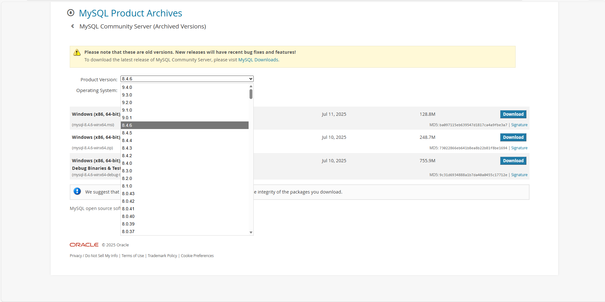
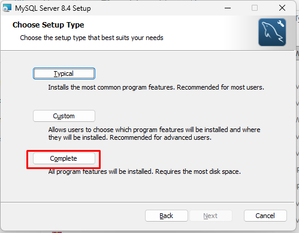
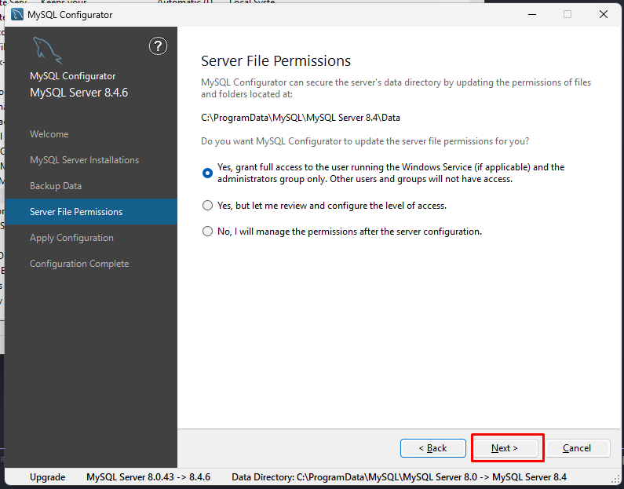
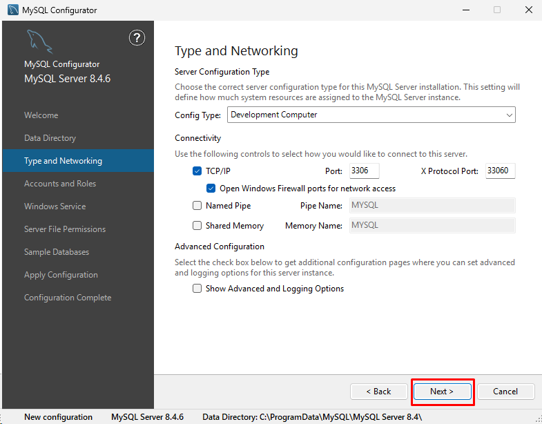

# MySQLインストール手順
ExmentでMySQLを使用するための手順です。  
※手順はOSやバージョンにより異なる場合があります。


## MySQL設定(Windows)

### MySQL 8.4へアップグレード(Windows)

本項は、すでにMySQL(例: 5.7 / 8.0)がインストール済みの環境を、MySQL 8.4へアップグレードする手順です。

- 推奨: アップグレード前にデータベースをバックアップします。
	- 例: [データベースバックアップ](https://dev.mysql.com/doc/refman/8.0/ja/mysqldump-sql-format.html)

- (MySQL 5.7が稼働中の場合) 管理者権限でコマンドプロンプトを起動し、サービスを停止します。


~~~
net stop mysql57
~~~

- 以下のページからMySQL Community Server(Windows)をダウンロードします。
	- 注意: MySQL InstallerはMySQL 8.0系のみ提供です。MySQL 8.1以降(8.4含む)は、MSIまたはZIPをダウンロードしてください。
	- [MySQL Community Server Downloads](https://downloads.mysql.com/archives/community/)
	- Select Versionで8.4.X、OSでWindows(x86, 64-bit)を選択します。


- 以下いずれかのパッケージをダウンロードします。
	- MSI Installer(推奨)
	- ZIP Archive(上級者向け)


- MSIを実行し、ウィザードに従います。
	- WelcomeでNext。

		
	- License Agreementを承諾してNext。

		
	- Setup typeは**Complete**。

		
	- Installをクリック。

		
	- インストール完了まで待ち、Finish。

		

- インストーラが既存のMySQLを検出し、**MySQL Server Installations**へ移動します。
	- **Perform an in-place upgrade of the existing MySQL Server installation** を選択します。
	- **Connect to the existing MySQL Server installation**:
		- **Port**: 既存MySQLのポート(通常`3306`)を入力します。
		- **Root password**: 既存MySQLの`root`パスワードを入力します。
		- **Connect**をクリックします。
	- 既存バージョン情報を確認し、**Next**。

		
	- **Backup Data** では、**Run a mysqldump backup prior to upgrade**(推奨)を選択してNext。

		
	- **Server File Permissions** は既定のままNext。

		
	- **Execute**で適用します。

		
	- 完了したら **Next** → **Finish**。

		

- `my.ini`(MySQL 8.4)を編集し、local infileを有効化します。
	- パス: `C:\ProgramData\MySQL\MySQL Server 8.4\my.ini`
	- `[mysqld]`配下(または末尾)に以下を追加します。

~~~
local-infile=1
~~~

- MySQLを再起動します(サービス名は環境により異なります)。

~~~
net stop mysql84
net start mysql84
~~~

- バージョンを確認します。

~~~
mysql --version
~~~

~~~
mysql -u root -p -e "SELECT VERSION();"
~~~


### MySQL 8.4の新規インストール(Windows)

MySQL未インストールの環境にMySQL 8.4を新規インストールする手順です。

- 以下のページからMySQL Community Server(Windows)をダウンロードします。
	- [MySQL Community Server Downloads](https://downloads.mysql.com/archives/community/)
	- Select Versionで8.4.X、OSでWindows(x86, 64-bit)を選択します。

	

- MSI Installer(推奨)をダウンロードします。
	

- MSIを実行し、ウィザードに従います。
	- Welcome / License / Setup type / Install:

		
		
		
		
		

- インストール後、自動的にMySQL Configuratorが起動します。
	- **Welcome to the MySQL Server Configurator** で **Next**。

		

- **Data Directory**: 既定のまま **Next**。

	

- **Type and Networking**:
	- **Config Type**: `Development Computer`
	- **Connectivity**: `TCP/IP`を有効(既定ポート`3306`)
	- **Next**。

		

- **Accounts and Roles**: `root`パスワードを設定して **Next**。

	

- **Windows Service**: サービス名(例: `MySQL84`)を設定して **Next**。

	

- **Server File Permissions**: 既定のまま **Next**。

	

- **Sample Databases**: 何も選択せず **Next**。

	

- **Apply Configuration**: **Execute** → **Next** → **Finish**。

	

- `my.ini`を編集し、local infileを有効化します。
	- パス: `C:\ProgramData\MySQL\MySQL Server 8.4\my.ini`
	- `[mysqld]`配下(または末尾)に以下を追加します。

~~~
local-infile=1
~~~


### 環境変数追加(Windows)

- エクスプローラから「PC」を右クリックし「プロパティ」をクリックします。

	

- 「システムの詳細設定」をクリックします。

	

- 「環境変数」をクリックします。

	

- 「ユーザー環境変数」の「Path」をクリックし「編集」をクリックします。

	

- 旧MySQLの`bin`パスが存在する場合は削除します(例: `C:\Program Files\MySQL\MySQL Server 5.7\bin`)。

	

- 「新規」をクリックし、以下の行を追加します。

~~~
C:\Program Files\MySQL\MySQL Server 8.4\bin
~~~

	

- 起動したダイアログをすべて「OK」で閉じて完了します。


## MySQL設定(Linux)
LinuxでのMySQLインストール/アップグレード手順です。  
※必要に応じてコマンドの先頭に`sudo`を付与してください。  
※インストール先がCentOS8、RHEL8等の場合は`yum`ではなく`dnf`をご利用ください。


### MySQL5.7→MySQL8.4へアップグレード(Linux)

- 推奨: アップグレード前にバックアップを取得します。

- MySQL5.7のパッケージを削除します。

~~~
sudo killall mysqld; sudo killall mysqld_safe;
sudo rpm -e --nodeps mysql57-community-release
sudo yum remove mysql mysql-server mysql-client mysql-common mysql-devel mysql-community-client-plugins -y
~~~

- MySQL8.4をインストールし起動します。

```bash
# CENTOS STREAMの場合

rpm -ivh https://dev.mysql.com/get/mysql84-community-release-el9-1.noarch.rpm
rpm --import https://repo.mysql.com/RPM-GPG-KEY-mysql-2023
dnf clean packages
dnf update -y

dnf install mysql-community-server -y
systemctl start mysqld
systemctl enable mysqld
```

```bash
# CENTOS 8の場合

sudo rpm -ivh http://dev.mysql.com/get/mysql84-community-release-el7-11.noarch.rpm
sudo rpm --import https://repo.mysql.com/RPM-GPG-KEY-mysql-2022

sudo yum search mysql-community-server
sudo yum -y module disable mysql

sudo yum -y install mysql-community-server
sudo systemctl enable mysqld.service
sudo systemctl start mysqld
```

- `my.cnf`を修正します。

~~~
vi /etc/my.cnf

# [mysqld]配下(または末尾)に以下を追加

local-infile=1
~~~

- MySQLを再起動します。

~~~
sudo systemctl restart mysqld
~~~


### MySQL8.0→MySQL8.4へアップグレード(Linux)

- 推奨: アップグレード前にバックアップを取得します。

- MySQLパッケージを更新します。

```bash
# CENTOS STREAM / RHEL / AlmaLinux / Rocky (dnf)
dnf update -y
dnf upgrade -y mysql-community-server mysql-community-client
systemctl restart mysqld
```

- バージョンを確認します。

```bash
mysql --version
mysql -u root -p -e "SELECT VERSION();"
```


### MySQL8.4の新規インストール(Linux)

- MySQL8.4をインストールし起動します。

```bash
# CENTOS STREAMの場合

rpm -ivh https://dev.mysql.com/get/mysql84-community-release-el9-1.noarch.rpm
rpm --import https://repo.mysql.com/RPM-GPG-KEY-mysql-2023
dnf clean packages
dnf update -y

dnf install mysql-community-server -y
systemctl start mysqld
systemctl enable mysqld
```

- MySQLの初期パスワードを確認します。

~~~
cat /var/log/mysqld.log | grep password

# 以下のようなログが出力されるので、パスワードを確認します
2016-09-01T13:09:03.337119Z 1 [Note] A temporary password is generated for root@localhost: uhsd!XXXXXX
~~~

- MySQLの初期設定を行います。

~~~
mysql_secure_installation
~~~

- `my.cnf`を修正します。

~~~
vi /etc/my.cnf

# [mysqld]配下(または末尾)に以下を追加

local-infile=1
~~~

- MySQLを再起動します。

~~~
sudo systemctl restart mysqld
~~~

- Exment用のデータベースとユーザーを作成します。  
※ここでは、データベース名を`exment_database`、ユーザーを`exment_user`とします。  
また、接続元のIPアドレスを`192.168.137.%`とします。

~~~
CREATE DATABASE exment_database;
CREATE USER 'exment_user'@'192.168.137.%' IDENTIFIED BY '(exment_user用のパスワード)';
GRANT ALL ON exment_database.* TO 'exment_user'@'192.168.137.%';
FLUSH PRIVILEGES;
~~~

- ファイアウォール設定で、接続元のIPアドレスからのMySQLアクセスのみ許可します。

~~~
firewall-cmd --permanent --new-zone=from_webserver
firewall-cmd --reload
firewall-cmd --permanent --zone=from_webserver --add-source="192.168.137.0/24"
firewall-cmd --permanent --zone=from_webserver --add-port=3306/tcp
firewall-cmd --zone=from_webserver --add-service=mysql
firewall-cmd --reload
~~~